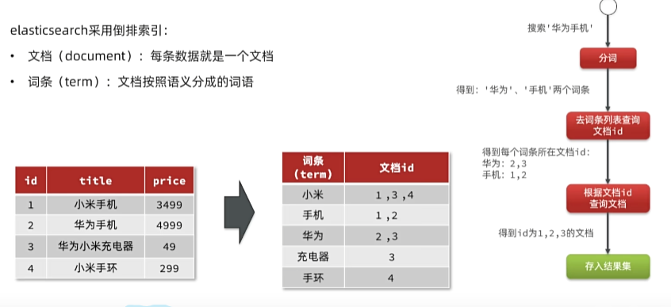
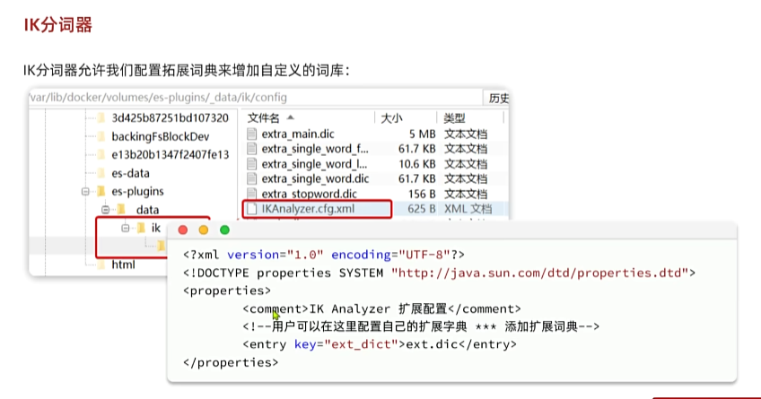

# ES

---

docker 安装：

    docker network create es

    docker run -d \
    --name es \
    -e "ES_JAVA_OPTS=-Xms512m -Xmx512m" \
    -e "discovery.type=single-node" \
    -v es-data:/usr/share/elasticsearch/data \
    -v es-plugins:/usr/share/elasticsearch/plugins \
    --privileged \
    --network es \
    -p 9200:9200 \
    -p 9300:9300 \
    elasticsearch:7.12.1
    
    
    
    docker run -d \
    --name kibana \
    -e ELASTICSEARCH_HOSTS=http://es:9200 \
    --network=es \
    -p 5601:5601  \
    kibana:7.12.1

---

## 倒排索引

传统数据库采用正向索引，elasticsearch采用的是倒排索引：

**文档（document）: 每条数据就是一个文档**

**词条（term）： 文档按照语义分成的词语**

正向索引： 基于文档id创建索引，根据id查询快，但是查询词条时必须先找到文档，而后判断是否包含词条

倒排索引： 对文档内容分词，对词条创建索引，并记录词条所在文档的id。查询时现根据词条查询到文档id，而后根据文档id查询文档

---

# IK分词器

中文分词往往需要根据语义分析，比较复杂，这就需要用到中文分词器，例如IK分词器。IK分词器时林良益在2006年开源发布的，其采用的正向迭代最细粒度切分算法一直沿用至今

[一个常见的ik分词器](https://release.infinilabs.com/analysis-ik/stable/)

支持的两种分词模式

1. ik_smart: 智能切分，粗粒度
2. ik_max_word: 最细切分，细粒度IK分词器

这个分词器允许我们自己配置拓展词典来增加自定义词库：

    通过修改目录下 config文件夹下的 IKAnalyzer.cfg.xml 指定自己的词典

---

## 一些基础概念

elasticsearch 中的文档数据会被序列化为json格式后存储在elasticsearch中

1. 索引(index)： 相同类型的文档集合，类似于数据库的表

2. 映射(mapping): 索引中文档的字段约束信息，类似表的结构约束

3. 字段(field): Json文档中的字段，类似于表中的列

4. 文档(Document): 就是一条条的数据，类似于表中的一行

5. DSL: es中提供的json风格的请求语句，用来定义搜索条件，类似于sql

---

## 索引库操作

常见 Mapping 映射属性：

1. type： 字段数据类型，常见的简单类型有：
   1. 字符串： text(可分词的文本)、keyword(精确值，例如：品牌、国家、IP地址)
   2. 数值： long、integer、short、byte、double、float
   3. 布尔： boolean
   4. 日期： date
   5. 对象： object
2. index： 是否创建索引， 默认值为true
3. analyzer： 使用哪种分词器
4. properties： 该字段的子字段

创建索引库请求语法：

    PUT /索引库名称
    {
        "mappings": {
            "properties": {
                "字段名1": {
                    "type": "text",
                    "analyzer": "ik_smart"
                },
                "字段名2": {
                    "type": "keyword",
                    "index": "false"
                },
                "字段名3": {
                    "properties": {
                        "子字段": {
                            "type": "keyword"
                        }
                    }
                }
            }
        }
    }

查询、删除 都遵循RestFull操作模式  （GET /索引库名称 、DELETE /索引库名称）

索引库和mapping一旦创建就无法修改，但是可以添加新的字段，添加新的字段用 PUT /索引库名/_mapping

---

## 文档操作

1. 新增文档的请求格式如下：

        POST /索引库名/_doc/文档id
        {
            "字段1": "值1",
            "字段2": "值2",
            "字段3": {
                "子属性1": "值3",
                "子属性2": "值4"
            }
        }

2. 查询文档格式如下

        GET /索引库名/_doc/文档id

3. 删除文档

        DELETE /索引库名/_doc/文档id

4. 修改文档

        修改分为两种：
        1. 全量修改，会删除旧文档，添加新文档(若id不存在就新增)
            PUT /索引库名/_doc/文档id
            {
                "字段":"值"
            }

        2. 增量修改，修改指定字段值
            POST /索引库名/_update/文档id
            {   
                "doc": {
                    "更新字段":"更新值"
                }
            }

5. 文档批量处理

ES中允许通过一次请求中携带多次文档操作，也就是批处理，语法格式如下：

    POST /_bulk
    { "index": {"_index": "索引库名"， "_id":"1"} }
    { "字段1":"值1","字段2":"值2"}
    { "index": {"_index": "索引库名"， "_id":"1"} }
    { "字段1":"值1","字段2":"值2"}
    { "index": {"_index": "索引库名"， "_id":"1"} }
    { "字段1":"值1","字段2":"值2"}
    { "delete": {"_index":"索引库名","_id": "1"} }
    { "update": {"_index":"索引库名","_id": "1"} }
    {"doc": {"字段2":"值2"} }
    
---

## DSL 查询

ElasticSearch 提供了DSL(Domain Specific Language)查询，就是以JSON格式来定义查询条件。

DSL查询可以分为两大类：

1. 叶子查询(Leaf query clauses): 一般是在特定的字段里查询特定值，属于简单查询，很少单独使用。
2. 符合查询(Compound query clauses)： 以逻辑方式组合多个叶子查询或者更改叶子查询的行为方式。

在查询以后，还可以对查询的结果做处理，包括：

1. 排序： 按照一个或多个字段值做排序
2. 分页： 根据from和size做分页
3. 高亮： 对搜索结果中的关键字加特殊样式，使其更加醒目
4. 聚合： 对搜索结果做数据统计以形成报表

基于DSL的基本查询语法如下：

    GET /索引库名/_search
    {
        "query": {
            "查询类型": {
                "查询条件"： "条件值"
            }
        }
    }

### 叶子查询

叶子查询还可以进一步细分，常见的有：

1. 全文检索(full text)查询： 利用分词器对用户输入内容分词，然后去词条列表中匹配。例如：

        match_query
        multi_match_query
2. 精确查询： 不对用户输入内容分词，直接精确匹配，一般是查找keyword、数值、日期、布尔等类型。例如：

        ids
        range
        term
3. 地理(geo)查询： 用于搜索地理位置，搜索方式很多。例如：
        
        geo_distance
        geo_boundind_box

全文检索语法：
    
    GET /索引库名/_search
    {
        "query": {
            "match": {
                "FIELD": "TEXT"
            }
        }
    }

    GET /索引库名/_search
    {
        "query": {
            "multi_match": {
                "query": "TEXT",
                "fields": ["FIELD1", "FIELD2"]
            }
        }
    }

精确查询语法：

    GET /索引库名/_search
    {
        "query": {
            "term": {
                "FIELD": {
                    "value": "VALUE"
                }
            }
        }
    }

    GET /索引库名/_search
    {
        "query": {
            "range": {
                "FIELD": {
                    "gte": 10,
                    "lte": 20
                }
            }
        }
    }

### 符合查询

符合查询大致可以分为两类：

1. 第一类： 基于逻辑运算组合叶子查询，实现组合条件,例如：

        bool
2. 第二类： 基于某种算法修改查询时的文档相关性算分，从而改变文档排名，例如：

        function_score
        dis_max

布尔查询是一个或多个查询子句的组合。子查询的组合方式有：

1. must: 必须匹配每个子查询，类似“与”
2. should： 选择性匹配子查询，类似“或”
3. must_not: 必须不匹配，不参与算分，类似：“非”
4. filter： 必须匹配，不参与算分

语法格式：

    GET /索引库名称/_search
    {
        "query": {
            "bool": {
                "must": [
                    {"match": {"FIELD":"TEXT"}}
                ],
                "should": [
                    {"term": {"field": {"value": "xxx"}}}
                    {"term": {"field": {"value": "xxx"}}}
                ],
                "must_not": [
                    {"range":{"price":{"gte": 2500}}}
                ],
                "filter": [
                    {"range": {"price": {"lte":9999}}}
                ]
            }
        }
    }

### 排序和分页

elasticsearch 支持对搜索结果排序，默认是根据相关度算分(_score)来排序，也可以指定字段排序。可以排序的字段类型有：keyword类型、数值类型、地理坐标类型、日期类型等。

语法格式：

    GET /索引库名称/_search
    {
        "query": {
            "match_all": {}
        }
        "sort": [
            {"FIELD":"desc"},
            {"FIELD":"asc"}
        ]
    }

elasticsearch 默认情况下只返回top10的数据。如果要查询更多的数据就需要修改分页参数了。elasticsearch中通过修改from、size参数来控制要返回的分页结果

from： 从第几个文档开始

size： 总共查询几个文档

    GET /索引库名称/_search
    {
        "query": {
            "match_all": {}
        },
        "from": 0,
        "size": 10,
        "sort": [
            {"FIELD":"desc"},
            {"FIELD":"asc"}
        ]
    }

深度分页问题：

    elasticsearch的数据一般会采用分片存储，也就是吧一个索引中的数据分成n份，存储到不同的节点上，查询数据时需要汇总各个分片的数据。

针对深度分页问题，ES提供了两种解决方案：

1. search after： 分页时需要排序，原理是从上一次排序的值开始查询下一页的数据，官方推荐使用的方式

        优点： 没有查询上限，支持无限深度
        缺点： 只能向后逐页查询，不能随机翻页
        场景： 数据迁移、手机滚动查询等
2. scroll： 原理是将排序数据形成快照，保存在内存。官方已经不推荐使用

### 高亮显示

就是指在搜索结果中把搜索关键字突出显示，语法：

    GET /索引库名称/_search
    {
        "query": {
            "match_all": {}
        },
        "highlight": {
            "fields": {
                "FIELD": {
                    "pre_tags": "<em>",
                    "post_tags": "</em>"
                }
            }
        }
    }

    指示在高亮显示字段前面加<em>后面加</em>

