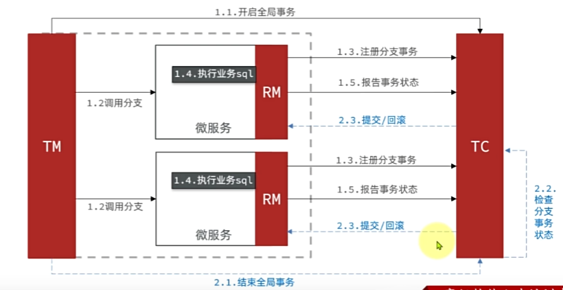
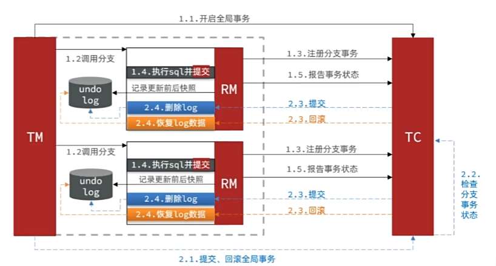

# 分布式事物

---

在分布式系统中，如果一个业务需要多个服务合作完成，而且每一个服务都有事物，多个事务必须同时成功或失败，这样的事物就是分布式事物。其中的每个服务就是一个分支事物。整个业务称为全局事物。

分布式事物解决思路： 使各个子事物之间必须能感知到彼此的状态，才能保证整个事物的状态一致。

Seata [Seata](https://seata.apache.org/)

Seata 事务管理中有三个重要角色：

1. TC(Transaction coordinator)-事物协调者： 维护全局和分支事物的状态，协调全局事物提交或回滚。
2. TM(Transaction Manager)-事务管理器： 定义全局事务的范围、开始全局事务、提交或回滚全局事务。
3. RM(Resource Manager)-资源管理器： 管理分支事物，与TC交谈以注册分支事物和报告分支事物的状态。

分布式事物模式

1. XA模式 
    
        XA规范 是X/Open组织定义的分布式事物处理（DTP Distributed Transaction Processing）标准，XA规范
        描述了全局的TM与局部的RM之间的接口，几乎所有主流的关系型数据库都对XA规范提供了支持。

    

        一阶段的工作：
            1. RM注册分支事物到TC
            2. RM执行分支业务sql但不提交
            3. RM报告执行状态到TC
        二阶段的工作：
            1. TC检测各个分支事物执行状态
                1.1 如果都成功，通知所有RM提交事物
                1.2 如果有失败，通知所有RM回滚事物
            2. RM接收TC指令，提交或回滚事物

    XA模式的优点：
    1. 事物的强一致性，满足ACID原则
    2. 常用数据库都支持，实现简单，并且没有代码侵入
    
    XA模式的缺点：
    1. 因为一阶段需要锁定数据库资源，等二阶段结束才释放，性能较差
    2. 依赖关系型数据库实现事物

2. AT模式

        Seata主推的是AT模式，AT模同样是分阶段提交的事物模型，不过弥补了XA模型中资源锁定周期过长的缺陷

    

        一阶段的工作：
            1. 注册分支事物
            2. 记录undo-log（数据快照）
            3. 执行业务sql并提交
            4. 报告事物状态
        二阶段的工作：
            如果是提交： 删除undo-log即可
            如果是回滚： 根据undo-log恢复数据到更新前

3. 对比

        · XA模式一阶段不提交事务，锁定资源；AT模式一阶段直接提交事物，不锁定资源
        · XA模式依赖数据库机制实现回滚；AT模式利用数据快照实现数据回滚
        · XA模式强一致；AT模式最终一致

