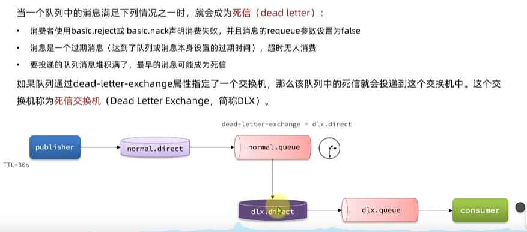
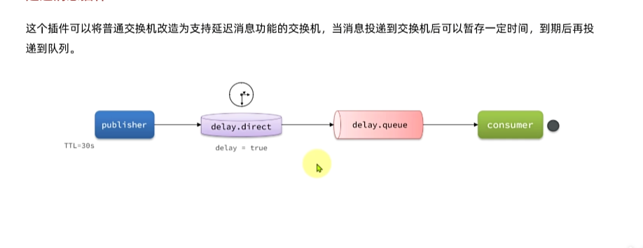

# 消息队列 RabbitMQ

---

    异步调用通常是基于消息通知的方式，包含三个角色：
    1. 消息发送者： 投递消息的人，就是原来的调用者
    2. 消息接收者： 接收和处理消息的人，就是原来的服务提供者
    3. 消息代理： 管理、暂存、转发消息，可以理解成类似于微信服务器

MQ 的技术选型

|        | RabbitMQ             | ActiveMQ                       | RocketMQ | Kafka      |
|--------|----------------------|--------------------------------|----------|------------|
| 公司/社区  | Rabbit               | Apache                         | 阿里       | Apache     |
| 开发语言   | erlang               | Java                           | Java     | Scala&Java |
| 协议支持   | AMQP、XMPP、SMTP、STOMP | OpenWrite、STOMP、REST、XMPP、AMQP | 自定义协议    | 自定义协议      |
| 可用性    | 高                    | 一般                             | 高        | 高          |
| 单机吞吐量  | 一般                   | 差                              | 高        | 非常高        |
| 消息延迟   | 微秒级                  | 毫秒级                            | 毫秒级      | 毫秒以内       |
| 消息可靠性  | 高                    | 一般                             | 高        | 一般         |

RabbitMQ 的几个概念


1. publisher： 消息发送者
2. consumer： 消息的消费者
3. queue： 队列、存储消息
4. exchange： 交换机，负责路由消息

---

Work Queues 

    任务模型。简单来说就是让多个消费者绑定到一个队列，共同消费队列中的消息。

    默认情况下，RabbitMQ会将消息轮询发给绑定在队列上的每一个消费者，但这并没有开了到消费者是否
    已经处理完消息，可能出现消息堆积，因此我们需要修改配置，设置preFetch为1，确保同一时刻最多
    投递给消费者1个消息，待消息处理完成后再投递下一条。 spring.rabbitmq.listener.simple.prefetch=1

交换机的作用主要是接收发送者的消息，并将消息路由到与其绑定的队列。

1. Fanout交换机 （广播）

        Fanout Exchange 会将接收到的消息路由到每一个跟其绑定的queue，所以也叫广播模式
        每个queue的消费者都会收到该消息。
2. Direct交换机 （定向）

        Direct Exchange 会将接收道德消息根据规则路由到指定的Queue，因此称为定向路由
        · 每一个Queue斗鱼Exchange设置一个BindingKey
        · 发布者发布消息时，指定消息的RoutingKey
        · Exchange将消息路由到BindingKey与消息RoutingKey一致的队列
        · 当每个队列都绑定同一个RoutingKey 则与fanout一样
3. Topic交换机 （通配定向）

        Topic Exchange 也是基于RoutingKey做消息路由，但是routingKey通常是多个单词组合，以.分割
        Queue与Exchange指定BingingKey时可以使用通配符
            · #： 代指0个或多个单词
            · *： 代指一个单词
        

SpringAMQP 提供了几个类用来声明队列、交换机及其绑定关系

1. Queue： 用于声明队列，可以用工厂类QueueBuilder构建
2. Exchange： 用于声明交换机，可以用工厂类ExchangeBuilder构建
3. Binding： 用于声明队列和交换机的绑定关系，可以用工厂类BindingBuilder构建


SpringAMQP还提供了基于@RabbitListener注解声明队列和交换机的方式


---

## 发送者的可靠性

1. 发送者重连

    有的时候由于网络波动，可能会出现发送者连接MQ失败的情况。通过配置我们可以开启连接失败后的重试机制
            
    配置如下：
    
    ```yaml
    spring:
      rabbitmq:
        connection-timeout: 1s # 设置mq的连接超时时间
        template:
          retry:
            enabled: true # 开启超时充值机制
            initial-interval: 1000ms # 失败后的初始等待实践
            multiplier: 1  # 失败后瑕疵的等待时长倍数，下次等待时长= initial-interval * multipler
            max-attempts: 3 # 最大重试次数
    ```
    **注： 当网络不稳定的时候，利用重试机制可以有效提高发送消息的成功率。不过SpringAMQP提供的重试机制时阻塞式的重试，也就是说多次重试等待的过程中，当前线程是被阻塞的，影响业务性能**

2. 发送者确认

    SpringAMQP提供了Publisher Confirm和Publisher Return两种确认机制。开启确认机制后，当发送者发送消息给MQ后，MQ会返回确认结果给发送者

    返回的结果有以下几种情况：
    
   1. 消息投递到了MQ但是路由失败。此时会通过PublisherReturn返回路由异常原因，然后反回ACK，告知投递成功
   2. 临时消息投递到了MQ，并且入队成功，返回ACK，告知投递成功。
   3. 持久消息投递到了MQ，并且入队完成持久化，返回ACK，告知投递成功。
   4. 其他情况都会返回NACK，告知投递失败。

    对应配置如下：
    
    ```yaml
      spring:
        rabbitmq:
          publisher-confirm-type: correlated # 开启publisher confirm机制，并设置confirm类型
          publisher-returns: true # 开启publisher的return机制
    ```
   
    配置说明：
        
        这里publisher-confirm-type有三种模式可选
            1. none： 关闭confirm机制
            2. simple： 同步阻塞等待mq的回执消息
            3. correlated： mq异步回调方式返回回执消息

    然后配置ReturnCallback
        
        每个RabbitTemplate只能有一个ReturnCallBack，因此在项目启动过程中就可以进行配置了

    再配置ConfirmCallback

        每一次发送都要使用一个ConfirmCallback，通过CorrelationData类实现getFeature().addCallback()方法实现

## MQ的可靠性

1. 数据持久化&lazyQueue

    在默认情况下，RabbitMQ会将接收到的信息保存在内存中以降低消息收发的延迟。这样会导致两个问题

    · 一旦MQ宕机，内存中的消息会丢失
    · 内存空间有限，当消费者故障或处理过慢时，会导致消息积压，引发MQ阻塞

    RabbitMQ实现数据持久化包括三个方面

        1. 交换机持久化  （默认）
        2. 队列持久化   （默认）
        3. 消息持久化   （需要指定）(SpringAMQP中默认是持久化的)

    从RabbitMQ3.6.0版本开始，就增加了LazyQueue的概念，也就是惰性队列
    
    惰性队列的特征如下：
        
        · 接收到消息后直接存入磁盘，不再存储到内存
        · 消费者要消费消息时才会从磁盘中读取并加载到内存（可提前缓存部分消息到内存，最多2048条）
    
    在3.12版本后，所有的队列都是LazyQueue模式，无法更改。

## 消费者的可靠性

1. 消费者确认机制

    消费者确认机制(Consumer Acknowledgement) 是为了确认消费者是否成功处理消息。当消费者处理消息结束后，应该向RabbitMQ发送一个回执，告知RabbitMQ自己消息的处理状态

   1. ack： 成功处理消息，RabbitMQ从队列中删除该消息
   2. nack： 消息处理失败，RabbitMQ需要再次投递消息
   3. reject： 消息处理失败并拒绝该消息，RabbitMQ从队列中删除该消息

    SpringAMQP已经实现了消息的确认功能。并允许我们通过配置文件选择ack的处理方式，一共有三种方式：

        ·none： 不处理，即消息投递给消费者后立刻ack，消息会立刻从MQ删除，非常不安全，不建议使用。
        ·manual： 手动模式，需要自己在业务代码中调用api，发送ack或reject，存在业务入侵，但更灵活
        ·auto： 自动模式，SpringAMQP利用AOP对我们的消息处理逻辑做了环绕增强，当业务正常执行时则自动返回ack，
                当业务出现异常时，根据异常判断返回不同结果：
                    · 如果是业务异常，会自动返回nack
                    · 如果是处理或校验异常，自动返回reject

    配置如下：
    
    ```yaml
      spring:
        rabbitmq:
          listener:
            simple:
              acknowledge-mode: auto  # none、manual、auto
   ```
   
2. 失败重试机制

    springAMQP提供了消费者失败重试机制，在消费者出现异常时利用本地重试，而不是无限的requeue到mq。我们可以通过在application.yaml中添加配置来开启重试机制

    ```yaml
      spring:
        rabbitmq:
          listener:
            simple:
              retry:
                enable: true # 开启重试
                initial-interval: 1000ms # 初始失败的等待时长
                multiplier: 1 # 下次失败的等待时长倍数， 下次等待时长 = multiplier * last-interval
                max-attempts: 3 # 最大重试次数
                stateless: true # true 无状态；false有状态。如果业务中包含事物则改为false
    ```
    在开启重试模式后，重试次数耗尽，如果消息依然失败，则需要有MessageRecover接口来处理，它包含三种不同的实现：
        
        1. RejectAndDontRequeueRecover： 重试耗尽后，直接reject 丢弃消息。默认方式
        2. ImmediateRequeueMessageRecover：重试耗尽后，返回nack，消息重新入队
        3. RepublishMessageRecover： 重试耗尽后，将失败消息投递到指定的交换机

    失败消息处理策略：
        
        1. 首先，定义接收失败消息的交换机、队列及其绑定关系，此处略
        2. 然后定义一个Recover的bean用来处理失败消息

            例如：
            @Bean
            public MessageRecover republishMessageRecover(RabbitTemplate rabbitTemplate) {
                return new RepublishMessageRecover(rabbitTemplate, "error.direct", "error");
            }

3. 业务幂等处理

   1. 唯一消息id： 给每个消息都设置一个唯一id，利用id区分是否是重复消息（MessageConvertor自带）
        
      1. 每条消息都生成一个唯一的id，与消息一起投递给消费者。
      2. 消费者接收到消息后处理自己的业务，业务处理成功后将消息id保存到数据库
      3. 如果下次又收到相同消息，去数据库查询判断是否存在，存在则为重复消息放弃处理

   2. 业务判断： 结合业务逻辑，基于业务本身做判断

## 延迟消息

延迟消息： 是指发送者发送消息时指定一个时间，消费者不会立刻收到消息，而是在指定时间之后才收到消息

延迟任务： 设置在一定时间之后才执行的任务

1. 死信交换机

    当一个队列中的消息满足下列情况之一时，就会成为死信（dead letter）：

        1. 消费者使用basic.reject 或 basic.nack 声明消费失败，并且消息的requeue参数设置为false
        2. 消息是一个过期消息（达到了队列或者消息本身设置的过期时间），超时无人消费
        3. 要投递的消息队列堆积满了，最早的消息可能成为死信
    
    如果队列通过dead-letter-exchange属性指定了一个交换机，那么该队列中的死信就会投递到这个交换机中。这个交换机称为死信交换机，简称DLX

    

2. 延迟消息插件

    这个插件可以将普通交换机改造为支持延迟消息功能的交换机。当消息投递到交换机后可以暂存一定时间，到期后再投递到队列。

    

    插件名： rabbitmq_delayed_message_exchange
