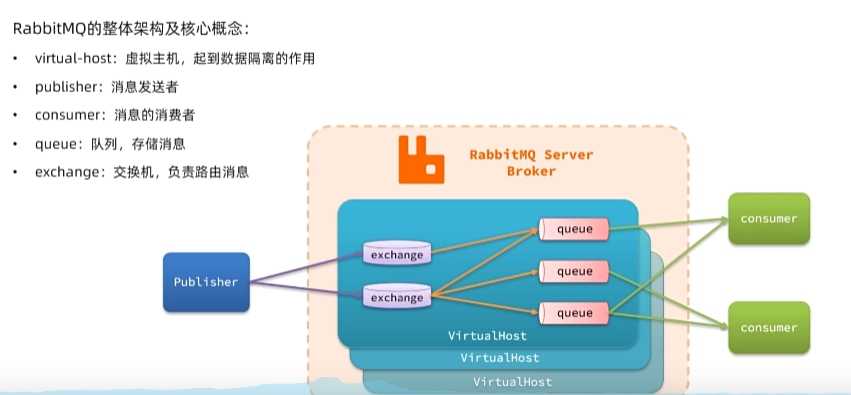
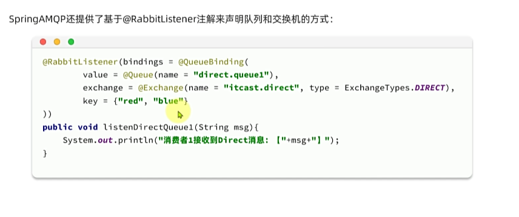

# 消息队列 RabbitMQ

---

    异步调用通常是基于消息通知的方式，包含三个角色：
    1. 消息发送者： 投递消息的人，就是原来的调用者
    2. 消息接收者： 接收和处理消息的人，就是原来的服务提供者
    3. 消息代理： 管理、暂存、转发消息，可以理解成类似于微信服务器

MQ 的技术选型

|        | RabbitMQ             | ActiveMQ                       | RocketMQ | Kafka      |
|--------|----------------------|--------------------------------|----------|------------|
| 公司/社区  | Rabbit               | Apache                         | 阿里       | Apache     |
| 开发语言   | erlang               | Java                           | Java     | Scala&Java |
| 协议支持   | AMQP、XMPP、SMTP、STOMP | OpenWrite、STOMP、REST、XMPP、AMQP | 自定义协议    | 自定义协议      |
| 可用性    | 高                    | 一般                             | 高        | 高          |
| 单机吞吐量  | 一般                   | 差                              | 高        | 非常高        |
| 消息延迟   | 微秒级                  | 毫秒级                            | 毫秒级      | 毫秒以内       |
| 消息可靠性  | 高                    | 一般                             | 高        | 一般         |

RabbitMQ 的几个概念

1. publisher： 消息发送者
2. consumer： 消息的消费者
3. queue： 队列、存储消息
4. exchange： 交换机，负责路由消息

---

Work Queues 

    任务模型。简单来说就是让多个消费者绑定到一个队列，共同消费队列中的消息。

    默认情况下，RabbitMQ会将消息轮询发给绑定在队列上的每一个消费者，但这并没有开了到消费者是否
    已经处理完消息，可能出现消息堆积，因此我们需要修改配置，设置preFetch为1，确保同一时刻最多
    投递给消费者1个消息，待消息处理完成后再投递下一条。 spring.rabbitmq.listener.simple.prefetch=1

交换机的作用主要是接收发送者的消息，并将消息路由到与其绑定的队列。

1. Fanout交换机 （广播）

        Fanout Exchange 会将接收到的消息路由到每一个跟其绑定的queue，所以也叫广播模式
        每个queue的消费者都会收到该消息。
2. Direct交换机 （定向）

        Direct Exchange 会将接收道德消息根据规则路由到指定的Queue，因此称为定向路由
        · 每一个Queue斗鱼Exchange设置一个BindingKey
        · 发布者发布消息时，指定消息的RoutingKey
        · Exchange将消息路由到BindingKey与消息RoutingKey一致的队列
        · 当每个队列都绑定同一个RoutingKey 则与fanout一样
3. Topic交换机 （通配定向）

        Topic Exchange 也是基于RoutingKey做消息路由，但是routingKey通常是多个单词组合，以.分割
        Queue与Exchange指定BingingKey时可以使用通配符
            · #： 代指0个或多个单词
            · *： 代指一个单词
        

SpringAMQP 提供了几个类用来声明队列、交换机及其绑定关系

1. Queue： 用于声明队列，可以用工厂类QueueBuilder构建
2. Exchange： 用于声明交换机，可以用工厂类ExchangeBuilder构建
3. Binding： 用于声明队列和交换机的绑定关系，可以用工厂类BindingBuilder构建

SpringAMQP还提供了基于@RabbitListener注解声明队列和交换机的方式

    
