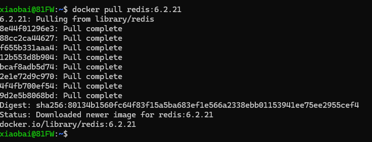
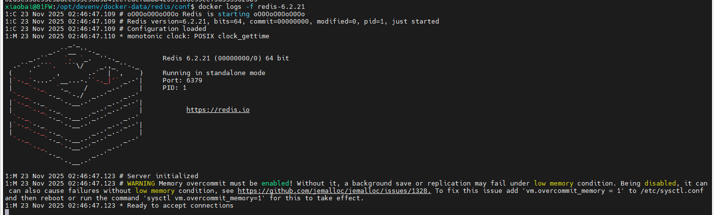

# Redis 6.2.21

---

1. 安装镜像: [https://hub.docker.com/_/redis/tags](https://hub.docker.com/_/redis/tags)

    这里使用的是6.2.21 版本
    
    

2. 设定配置文件和外置挂载数据目录

    这里提供一个配置文件，仅作为demo使用
    
    ```shell
    protected-mode no
    port 6379
    tcp-backlog 511
    timeout 0
    tcp-keepalive 300
    databases 20
    always-show-logo yes
    dbfilename dump.rdb
    dir /data
    ```
    因为设定了数据目录为 /data  所以我们在挂载的时候直接将实际目录挂载到/data 即可
    **注意：不要把daemonize设置为true，因为docker需要一个执行进程**    

3. 最终的命令如下：

    ```shell
    docker run -it -d --restart=always --name redis-6.2.21 \
    -v /your/config/path:/conf \
    -v /your/data/path:/data \
    -p 6379:6379 \
    redis:6.2.21 \
    redis-server /conf/redis.conf
    ```
4. 启动成功后

    启动成功日志应为这样：

    

    
    