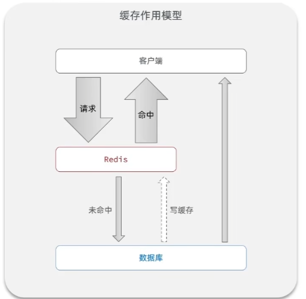

# Redis 缓存

---

缓存就是数据交换的缓冲区，称作cache，是贮存数据的临时地方，一般读写性能较高。

缓存的作用：

1. 降低后端负载
2. 提高读写效率，降低响应时间

使用缓存的成本

1. 数据一致性成本
2. 代码维护成本
3. 运维成本

---

## 添加Redis缓存

缓存作用模型： 

查询模型：

    1. 查询redis是否存在
    2. 存在直接返回结果
    3. 不存在，查询数据库
    4. 数据库不存在，直接返回未找到
    5. 数据库存在，更新到缓存中
    6. 返回结果

