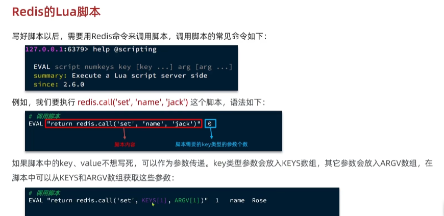

# Redis使用

---

## 全局唯一id

全局id生成器是一种在分布式系统下用来生成全局唯一id的工具，一般要满足下列特性：

1. 唯一性

2. 高可用

3. 高性能

4. 递增性

5. 安全性

        为了增加id的安全性，我们可以不直接使用redis的自增的数值，而是拼接一些其他的信息
        id 组成部分： 符号位(1bit) + 时间戳(31bit)  + 序列号(32bit)

        其中的序列号部分可以用redis的自增，时间错可以用到某一天的毫秒数

---

## 优惠券秒杀下单

超卖问题，需要加锁解决

悲观锁理念： 认为线程安全问题一定发生，因此在操作数据之前先获取锁，确保线程串行

乐观锁理念： 认为线程安全问题不一定发生，因此不加锁，只是在更新数据的时候判断有没有其他线程对数据做了修改 -> 如果数据没被修改则更新数据；如果已经被其他线程修改则重试或者异常

乐观锁数据判断方式：
    
    版本号法： 每当数据做一次修改，版本号加一，修改数据之前和之后判断版本号是否变化
    CAS法： 当数据修改时，先判断要修改的数据是否为之前的数据，只有是之前的数据才更新。

---

## 分布式锁

满足分布式系统或集群模式下多进程可见并且互斥的锁。

常见分布式锁解决方案及特点

|      | MySQL           | Redis         | Zookeeper       |
|------|-----------------|---------------|-----------------|
| 互斥   | 利用mysql本身的互斥锁机制 | 利用setNx互斥命令   | 利用节点唯一性和有序性实现互斥 |
| 高可用  | 好               | 好             | 好               |
| 高性能  | 一般              | 好             | 一般              |
| 安全性  | 断开连接自动释放锁       | 利用锁超时时间，到期释放  | 临时节点，断开连接自动释放   |

使用Redis 实现分布式锁

    获取： setnx + expire 要保证同时成功或者失败 --> set 高级用法：  SET key value EX 10 NX
    释放： del 

出现的问题： 由于锁超时或者解锁错误导致的锁被误删除。解决方案： 添加加锁线程标识到value

分布式锁原子性问题： 判断锁标识和释放锁是两个操作，中间可能被阻塞就会产生问题。解决该原子性的问题使用redis的LUA脚本

LUA: 在一个脚本中编写多条redis命令，确保多条命令执行时的原子性。lua是一个语言，参考 [LUA语言](https://www.runoob.com/lua/lua-tutorial.html)

使用 redis.call方法 执行redis 的命令 然后使用Redis的EVAL 执行脚本

    EVAL "return redis.call('set', name,'jack')" 0

