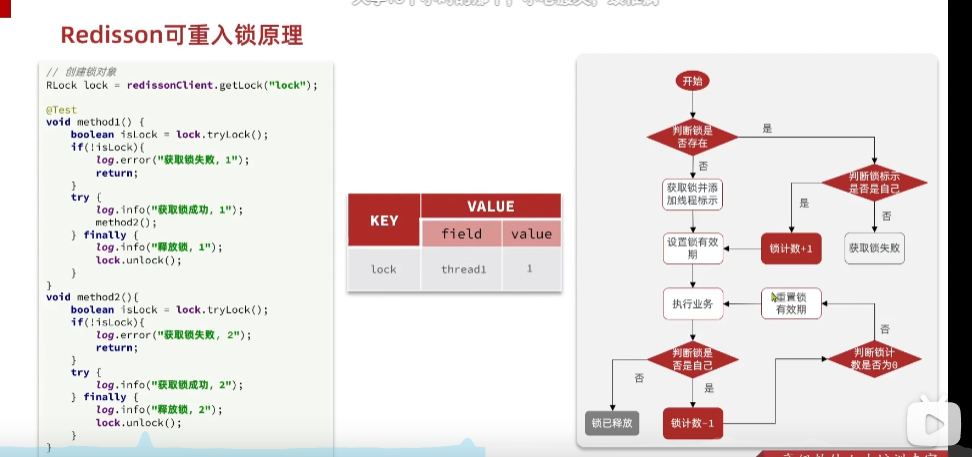
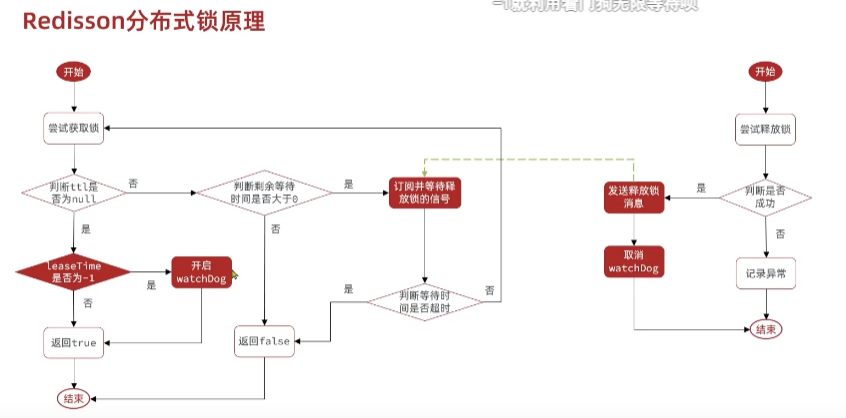

# Redisson

---
Redisson 是一个在Redis的基础上实现的java驻内存数据网格（In-Momory Data Grid）。 它不仅提供了一系列的分布式的java常用对象，还提供了许多分布式服务，其中就包含了各种分布式锁的实现。

官网地址： [https://redisson.org](https://redisson.org)

---

## Redisson 可重入锁

使用hash结构实现，既保存当前线程，又保存当前重入次数。

---

## Redisson 锁重试和看门狗

MultiLock 联锁，使用多个redis进行加锁，防止单个redis崩溃导致问题

