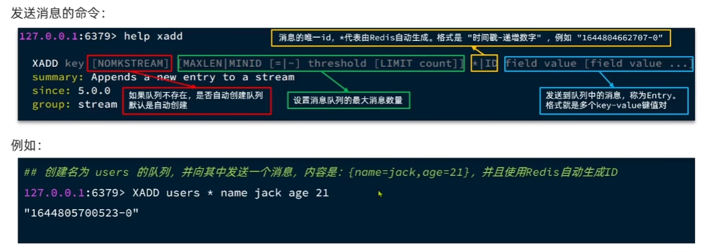
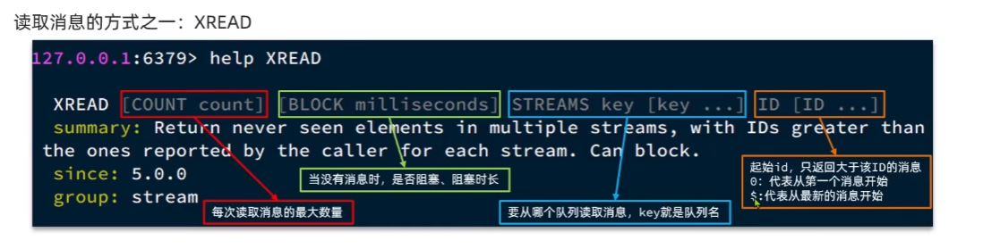

# Redis 队列

---

消息队列： Message Queue 字面意思就是存放消息的队列。最简单的消息队列包括三个角色：

消息队列： 存储和管理消息，也被称为消息代理

生产者： 发送消息到消息队列

消费者： 从消息队列获取消息并处理消息

Redis 提供了三种不同方式实现消息队列：

list结构： 基于List结构模拟消息队列

PubSub结构： 基本的点对点消息模型

Stream： 比较完善的消息队列模型

---

## 基于list 实现消息队列

使用LPUSH 和 BRPOP   或者  RPUSH 和 BLPOP 实现

优点：

    1. 基于Redis存储，不受限于JVM内存上限
    2. 基于Redis的持久化机制，数据安全性有保证
    3. 可以满足消息有序性

缺点：

    1. 无法避免消息丢失
    2. 只支持单消费者

---

## PubSub 消息队列

PubSub是redis2.0版本引入的消息传递模型。顾名思义，消费者可以订阅一个或多个channel， 生产者向对应channel发送消息后，所有订阅者都能收到相关消息

SUBSCRIBE channel [channel] 订阅一个或多个频道

PUBLISH channel msg 向一个频道发送消息

PSUBSCRIBE pattern [pattern] 订阅与pattern格式匹配的所有频道

优点：

    采用发布订阅模型，支持多生产多消费

缺点：

    1. 不支持数据持久化
    2. 无法避免消息丢失
    3. 消息堆积有上限，超出时数据丢失

---

## Stream 消息队列

Stream 是 Redis 5.0 引入的一种新数据类型，可以实现一个功能非常完善的消息队列

XADD 添加消息

XREAD 读取

XREAD 命令的特点：

    1. 消息可回溯
    2. 一个消息可以被多个消费者读取
    3. 可以阻塞读取
    4. 有漏读消息的风险

消费者组： 将多个消费者划分到一个组，监听同一个队列，具备下列特点：

    1. 消息分流： 队列中的消息会分流给组内的不同消费者，而不是重复消费，从而加快消息处理的速度
    2. 消息标示： 消费者组会维护一个标识，记录最后一个被处理的消息，哪怕消费者宕机重启，还会从标识之后读取消息，确保每一个消息都会被消费
    3. 消息确认： 消费者获取消息后，消息处于pending状态，并存入一个pending-list， 当处理完成后需要通过XACK来确认消息，标记消息为已处理，才会从pending-list移除

创建消费者组： XGROUP CREATE key groupName ID [MKSTREAM]

        key: 队列名称
        groupname 消费者组名称
        ID： 起始id  0从头开始 $从尾开始
        mkstream 队列不存在时自动创建队列

从消费者组读取消息： XREADGROUP GROUP group consumer [COUNT count] [BLOCK milliseconds] [NOACK] STREAMS key [key...] ID [ID...]

    group: 消费组名称
    consumer： 消费者名称，如果消费者不存在，会自动创建一个消费者
    count： 本次查询的最大数量
    BLOCK milliseconds： 当没有消息时最长等待时间
    NOACK： 无需手动ACK，获取到消息后自动确认
    STREAMS key： 指定队列名称
    ID： 获取消息的起始ID：
            > : 下一个未消费的消息开始
            其他： 根据指定id从pending-list中获取已消费但未确认的消息，例如0，是从pending-list中的第一个消息开始

确认消息： XACK key group ID [ID...]

    key： 队列名称
    group： 消费者组名称
    ID： 消息id

查看pending-list： XPENDING key group [[IDEL min-idel-time] start end count [consumer]]

    key: 队列名称
    group： 消费者组名称
    IDEL min-idel-time： 最小等待时间
    start： 起始时间   - 代表最小起始时间
    end： 终止时间    + 代表最大终止时间
    count： 获取数量
    consumer： 消费者名称

特点：

    1. 消息可回溯
    2. 可以多消费者争抢消息，加快消费速度
    3. 可以阻塞读取
    4. 没有漏消息的风险
    5. 有消息确认机制，保证消息至少被消费一次

实战-30 redis-消息队列-基于stream队列

