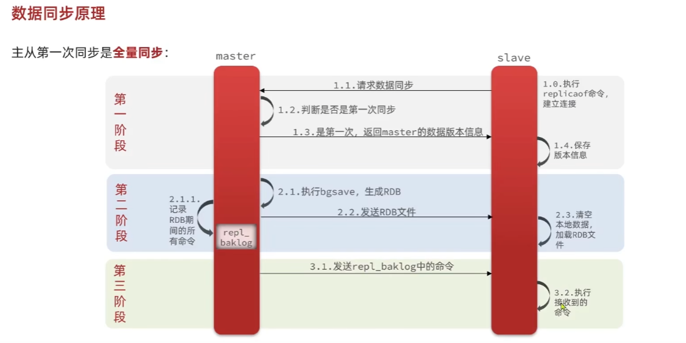
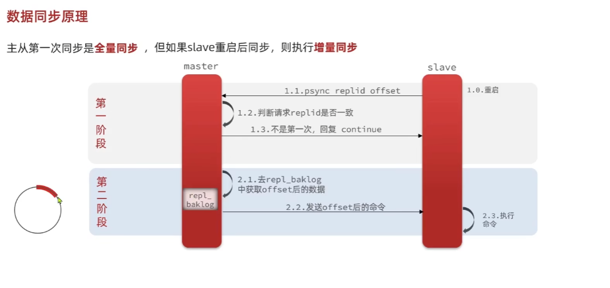

# 分布式缓存

---

## RDB 与 AOF

1. RDB：

        RDB全称Redis Database Backup file （Redis数据备份文件），也被叫做Redis数据快照。简单来说就是把内存中的所有数据都记录到磁盘中。
        当Redis实例故障重启后，从磁盘读取快照文件，恢复数据。
        快照文件称为RDB文件，默认是保存在当前运行的目录
        save 命令由redis主进程执行rdb，会阻塞所有命令
        bgsave 是开启子进程执行RDB，避免主进程受到影响，子进程共享主进程的内存数据。完成fork后读取内存数据并写入
        ，fork使用的是copy-on-write模式
        缺点：
            1. RDB执行间隔时间长，两次RDB之间写入的数据有丢失的风险
            2. fork子进程、压缩、写出RDB文件都比较耗时

2. AOF：

       AOF全称为Append Only File（追加文件）。Redis处理的每一个命令都会记录在AOF文件，可以看作是命令日志文件
        
       appendfsync:
          always: 每执行一次命令，立即写入
          everysec： 每隔一秒钟写到AOF一次
          no： 操作系统决定何时写入
       
       因为AOF是记录命令，所以文件要比RDB大的多，而且AOF会记录对同一个key的多次写操作，但只有最后一次写操作才有意义。
       通过执行bgrewriteaof命令，可以让AOF文件执行重写功能，用最少的命令达到相同的效果。

3. 对比

|         | RDB                     | AOF                              |
|---------|-------------------------|----------------------------------|
| 持久化方式   | 定时对整个内存做快照              | 记录每一次执行的命令                       |
| 数据完整性   | 不完整，两次备份之间会丢失           | 相对完整，取决于刷盘策略                     |
| 文件大小    | 会有压缩，文件体积小              | 记录命令，文件体积很大                      |
| 宕机恢复速度  | 很快                      | 慢                                |
| 数据恢复优先级 | 低，因为完整性不如AOF            | 高，因为数据完整性高                       |
| 系统资源占用  | 高，大量cpu和内存消耗            | 低，主要是磁盘IO资源，但AOF重写时会占用大量cpu和内存资源 |
| 使用场景    | 可以容忍数分钟的数据丢失，追求更快的启动速度  | 对数据安全性要求较高                       |

---

## Redis 主从集群

数据同步原理：

    主从同步第一次同步是全量同步，master如何判断slave是不是第一次来同步数据？->
    1. replication id: 简称replid，是数据集的标记，id一致则说明是同一数据集。
       每个master 都有唯一的replid，slave则会集成master节点的replid
    2.offset： 偏移量，随着记录在repl_baklog中的数据增多而逐渐增大。slave完成同步
       时也会记录当前同步的offset。如果slave的offset小于master的offset，说明slave的
       数据落后于master，需要更新。
    
    因此，slave做数据同步，必须向master声明自己的replicationid 和offset，master才可以判断
    到底需要同步哪些数据。

1. slave节点请求增量同步
2. master节点判断replid，发现不一致，拒绝增量同步
3. master将完成内存数据生成rdb，发送rdb到slave
4. slave清空本地数据，加载master的RDB
5. master将RDB期间的命令记录在repl_baklog,并持续将log中的命令发送给slave
6. slave执行接收到的命令，保持与master之间的同步

当slave重启后同步，就会进行增量同步

**注意：repl_baklog大小有上限，写满后会覆盖最早的数据。如果slave断开时间过久，导致尚未备份的数据被覆盖，则无法基于log做增量同步，只能再次全量同步**

主从集群的几点优化：

1. 在master中配置repl-diskless-sync yes 启用无磁盘复制，避免全量同步时的磁盘IO
2. Redis单节点的内存占用不要太大，减少RDB导致的过多磁盘IO
3. 适当提高repl_baklog的大小，发现slave宕机时尽快实现故障恢复，尽可能避免全量同步。
4. 限制一个master上的slave节点数量，如果实在是太多slave，则可以采用主-从-从链式结构，减少master 压力

---

## Redis 哨兵 

Redis提供了哨兵(sentinel)机制来实现主从集群的自动故障恢复。哨兵结构的作用：

1. 监控： sentinel会不断检查master和slave是否按预期工作
2. 自动故障恢复： 如果master故障，sentinel会将一个slave提升为master。当故障实例恢复后也以新的master为主
3. 通知：sentinel充当reids客户端的服务发现来源，当集群发生故障转移时，会将最新信息推送给redis的客户端

Sentinel 是基于心跳机制监测服务状态，每隔一秒向集群的每个实例发送ping命令：

    主观下线： 如果某sentinel节点发现某实例未在规定时间响应，则认为该实例主观下线
    客观下线： 若超过指定数量(quorum)的sentinel都认为该实例主观下线，则该实例客观下线。quorum的值最好超过sentinel实例数量的一半。

一旦发现master故障，sentinel需要在slave中选择一个作为新的master，选择依据：

    · 首先会判断slave节点与master 节点断开时间长短，如果超过指定值(down-after-millliseconds * 10),则会排除该slave节点
    · 然后判断slave节点的slave-priority值，越小优先级越高，如果是0则永不参与选举
    · 如果slave-priority一样，则判断slave节点的offset值，越大说明数据越新，优先级越高
    · 最后是判断slave节点的运行id大小，越小优先级越高

故障转移流程

    1. sentinel会给备选的slave1节点发送slaveof no one 命令，让该节点称为master
    2. sentinel会给其他slave发送slaveof ip port 命令，让这些slave称为新master的从节点，开始从新master上同步数据
    3. 最后，sentinel会将故障节点标记为slave，当故障节点恢复后会自动成为新的master的slave节点

高级-分布式缓存-13 分片集群
