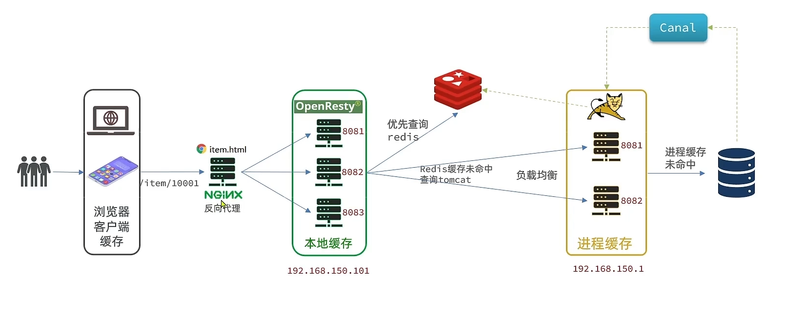

# 多级缓存

---

# Caffeine

基于java8开发的，提供了近乎最佳命中率的本地存储库

[Caffeine](https://github.com/ben-manes/caffeine)

三种缓存驱逐策略，防止缓存填满：
1. 基于容量： 设置容量的上限
2. 基于时间： 设置缓存的有效时间
3. 基于引用： 设置缓存为软引用或弱引用，利用GC来回收缓存数据。性能较差，不建议使用。

---

## Nginx lua

一些lua的语法：

| 数据类型     | 描述                                                                                      |
|----------|-----------------------------------------------------------------------------------------|
| nil      | 最简单，只有nil值属于该类型，表示一个无效值，作为bool表达式为false                                                 |
| boolean  | 包含两个值 true 和 false                                                                      |
| number   | 表示双精度类型的实浮点数                                                                            |
| string   | 字符串， 由一对双引号或者单引号来表示                                                                     |
| function | 由C或者LUA编写的函数                                                                            |
| table    | Lua中的表，其实是一个”关联数组“，数组的索引可以是数字、字符串或者表类型。在lua里，table的创建是通过“构造表达式”来完成，最简单的构造表达式{},用来创建一个空表 |

可以使用 type(变量) 来判断变量的数据类型

声明变量：  local 变量名 = 变量值   （不需要指定数据类型）

访问table中的数据： 
    
    带key的 ： 直接点  local a = {name='zhangsan', age=25} ==>  a.name
    不带key的： 下标    local b = {'a', 'b', 'c' }   =>  b[1] 就是 a // 下标从1开始

遍历整个table

    for index,value in ipairs(table) do
        xxxxxx
    end

拼接字符串用  ..  而不是  +    ==>  a..b => ab

函数：
    
    function 函数名 (参数1, 参数2, 参数3)
        -- 函数体
        return 返回值
    end

条件判断：

    if(布尔表达式)
    then
        -- true 逻辑
    else
        -- false 逻辑
    end

    布尔表达式的连接用英文单词   and or  not

---

## OpenResty

[OpenResty](https://openresty.org/cn/)

一些配置示例

1. nginx.conf 中的 http 块添加对OpenResty的lua支持

        # 加载lua模块
        lua_package_path "/your/lua/script/path/?.lua;;";
        # 加载c模块
        lua_package_cpath "/your/lua/c/script/path/?.so;;";

2. 配置local 支持lua解析

        location /xxx  {
            #默认响应类型
            default_type application/json;
            #响应数据由 xxx.lua这个文件决定
            coutent_by_lua_file xxx.lua;
        }

3. 一些请求参数的获取示例

| 参数格式     | 参数示例          | 解析代码                                                                              |
|----------|---------------|-----------------------------------------------------------------------------------|
| 路径占位符    | /item/1001    | 当请求匹配为  location /item/(\d+) 时， 使用 local id = ngx.var\[1\]                        |
| 请求头      | id: 1001      | local headers = ngx.req.get_headers()                                             |
| Get请求参数  | ?id=1001      | local getParams = ngx.req.get_uri_args()                                          |
| Post表单参数 | id=1001       | 请求体： ngx.req.read_body(), 表单参数table： local postParams = ngx.req.get_post_args()   |
| JSON参数   | {"id": 1001}  | 请求体： ngx.req.read_body(), body中的json参数： local jsonBody = ngx.req.get+body_data()  |

对于多后端例如多tomcat集群时，如果openResty 使用轮询算法，那需要在每个tomcat都要建立进程缓存，冗余量大，故在配置openResty的时候可以使用hash 算法实现负载均衡

    upstream tomcat-cluster {
        hash $request_uri;
        server aaa.aaa.aa.a:xxx;
        server bbb.bbb.bb.b:xxx;
    }

通过对url的hash实现轮询，这样同一个请求一直被打到同一个tomcat节点上，tomcat的进程缓存只需要一份。

---

## 冷启动与缓存预热

冷启动： 当服务刚刚启动时，Redis中并没有缓存，如果所有商品数据都在第一次查询时添加缓存，可能会给数据库带来较大压力。

缓存预热：在实际开发中，我们可以利用大数据统计用户访问的热点数据，在项目启动时将这些热点数据提前查询并保存到redis中。

---

## Nginx 本地缓存

OpenResty 为nginx提供了shard dict 的功能，可以在nginx的多个worker之间共享数据，实现缓存功能。

开启共享字典，需要在nginx.conf中配置：

    # 共享字典  名称为 item_cache 大小为 150M
    lua_shard_dict item_cache 150m;

操作共享字典：

    -- 获取本地缓存对象
    local item_cahe = ngx.shared.item_cache
    -- 存储，指定key value 过期时间 单位为秒 0 代表永不过期
    item_cache:set('key','value',1000)
    -- 读取
    local val = item_cache:get('key')

---

## 缓存同步

常见的同步策略有三种：

    设置有效期： 给缓存设置有效期，到期后自动删除。再次查询时更新
        ·优点： 简单、方便
        ·缺点： 时效性差，缓存过期时间可能不一致
        ·场景：更新频率较低，时效性要求低的业务

    同步双写： 在修改数据库同时，直接修改缓存
        ·优点： 时效性强，缓存与数据库强一致
        ·缺点： 有代码侵入，耦合度高
        ·场景： 对一致性、时效性要求较高的缓存数据

    异步通知： 在修改数据库时发送事件通知，相关服务监听到通知后修改缓存数据
        ·优点： 低耦合，可以同时通知多个缓存服务
        ·缺点： 时效性一般，可能存在中间不一致状态
        ·场景： 时效性要求一般，有多个服务需要同步

Canal 异步通知：

官网： [Canal](https://github.com/alibaba/canal)

基于mysql的主从同步来实现，将自己伪装成一个mysql的slave，通过监听binlog的变化，再把得到的变化通知给客户端，进而完成对其他数据的同步

