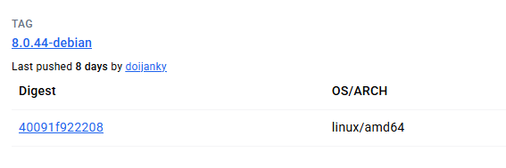
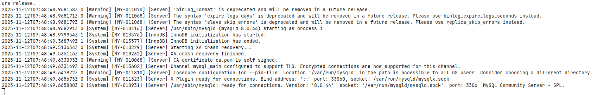
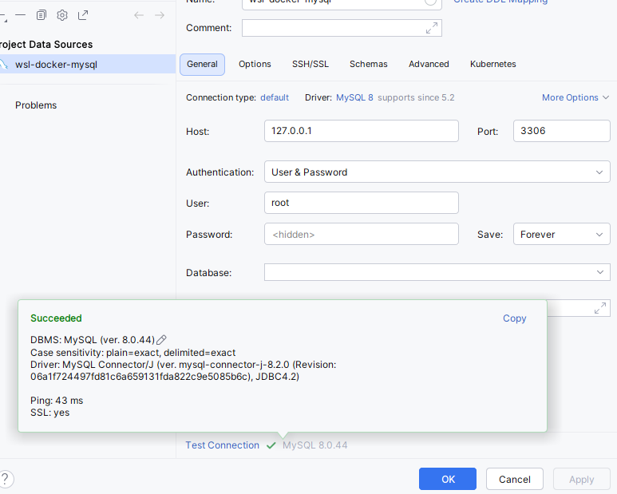

# mysql 8.0

---

1. 安装镜像： [https://hub.docker.com/_/mysql/tags](https://hub.docker.com/_/mysql/tags)

    这里以mysql 8.0 为例，当前最新版本为8.0.44 使用镜像为 8.0.44-debian
    

2.  根据镜像的文档设定一些参数

    2.1 设定root 账户的密码， 使用环境变量 MYSQL_ROOT_PASSWORD
    
    2.2  使用自定义的my.cnf 文件,这里提供一个基础版本

    ```shell
    [mysqld]
    pid-file        = /var/run/mysqld/mysqld.pid
    socket          = /var/run/mysqld/mysqld.sock
    datadir         = /var/lib/mysql
    bind-address    = 0.0.0.0
    symbolic-links  = 0
    secure-file-priv= NULL
    log-bin=mysql-bin
    binlog-ignore-db=mysql,information_schema,performance_schema,sys
    binlog_cache_size=1M
    binlog_format=row
    expire_logs_days=7
    slave_skip_errors=1062
    !includedir /etc/mysql/conf.d/
    ```
    将该文件挂载到容器的/etc/mysql/ 即可，这里使用目录挂载方式(该文件在/my/custom/path下)
    
    -v /your/config/path:/etc/mysql

    2.3 挂载数据目录

    将数据目录挂载到本地
    
    -v /my/data/path:/var/lib/mysql
    
    2.4 暴露端口

    方便外界访问，暴力 3306 和 33060 端口
    
    -p 3306:3306 -p 33060:33060

3. 最终的命令如下

```shell
docker run -it -d --name mysql-dev --restart=always \
-e MYSQL_ROOT_PASSWORD="your password" \
-v /your/config/path:/etc/mysql \
-v /your/data/path:/var/lib/mysql \
-p 3306:3306 -p 33060:33060 \
mysql:8.0.44-debian
```

4. 确认启动成功

    当容器启动后，可以通过命令 docker logs -f mysql-dev 查看容器日志，下图为成功启动的日志

    

5. 使用工具连接

    使用数据库工具进行连接，我这里是wsl 所以连接地址是 localhost, 连接地址需要自行判断，端口为3306 账户root 密码为环境变量中设置的密码
    


6. FAQ 
    
    6.1 日志中出现 mbind: Operation not permitted
   
        这是因为docker 默认的安全限制， docker 命令中增加  --cap-add=sys_nice 即可
        参考：
            https://stackoverflow.com/questions/55559386/how-to-fix-mbind-operation-not-permitted-in-mysql-error-log
            https://docs.docker.com/engine/security/seccomp/
            https://docs.docker.com/engine/containers/resource_constraints/


            