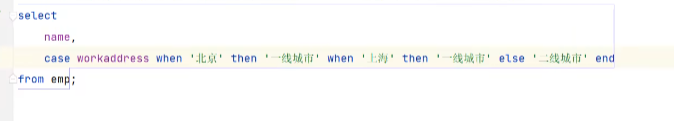

# 函数

---

## 字符串函数

常见字符串函数：

| 函数                        | 功能                                 |
|---------------------------|------------------------------------|
| CONCAT(S1,S2,...,Sn)      | 字符串拼接，将S1,S2...拼接成一个字符串            |
| LOWER(str)                | 将字符串转成小写                           |
| UPPER(str)                | 将字符串转成大写                           |
| LPAD(str,n,pad)           | 左填充，用字符串pad对字符串的左边进行填充，直到字符串达到n的长度 |
| RPAD(str,n,pad)           | 右填充，用字符串pad对字符串的右边进行填充，直到字符串达到n的长度 |
| TRIM(str)                 | 去掉字符串头尾的空格                         |
| SUBSTRING(str,start,len)  | 返回从字符串str的start位置起的len个字符          |

---

## 数值函数

常见的数值函数：

| 函数          | 功能                |
|-------------|-------------------|
| CEIL(X)     | 向上取整              |
| FLOOR(X)    | 向下取整              |
| MOD(X,Y)    | 返回x/y的模           |
| RAND()      | 返回0-1内的随机数        |
| ROUND(X,Y)  | 求参数x的四舍五入，保留y位小数  |

---

## 日期函数

| 函数                                | 功能                         |
|-----------------------------------|----------------------------|
| CURDATE()                         | 返回当前日期                     |
| CURTIME()                         | 返回当前时间                     |
| NOW()                             | 返回当前日期和时间                  |
| YEAR(date)                        | 获取指定date的年份                |
| MONTH(date)                       | 获取指定date的月份                |
| DAY(date)                         | 获取指定date的日期                |
| DATE_ADD(date,INTERVAL EXPR type) | 返回一个日期加上一个时间间隔expr后的值      |
| DATEDIFF(date1,date2)             | 返回起始date1 和结束时间date2之间的天数  |

DATE_ADD('2025-11-15 23:05:11', INTERVAL 10 DAY) ===> 2025-11-25 23:05:11

---

## 流程控制函数

| 函数                                                         | 功能                                     |
|------------------------------------------------------------|----------------------------------------|
| IF(value,T,F)                                              | 如果value为true则返回T，否则返回F                 |
| IFNULL(val1,val2)                                          | 如果val1不为空则返回val1，否则返回val2              |
| CASE WHEN [val1] THEN [res1] ... ELSE [default] END        | 如果val1 为true，则返回res1,...否则返回default默认值 |
| CASE [expr] WHEN [val1] THEN [res1]... ELSE [default] END  | 如果expr的值等于val1则返回res1， 否则返回default默认值  |   

**注： CASE WHEN 里面的WHEN 可以写多个**

