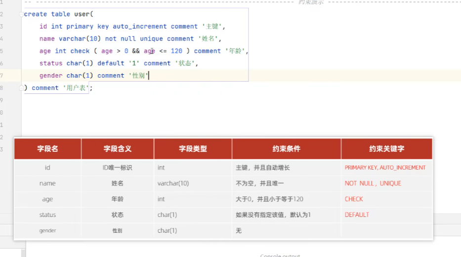

# 约束

---

约束是作用于表中字段的规则，用于限制存储在表中的数据，目的是为了保证数据库中的数据正确、有效和完整。

| 约束                   | 描述                           | 关键字         |
|----------------------|------------------------------|-------------|
| 非空约束                 | 限制该字段的数据不能为NULL              | NOT NULL    |
| 唯一约束                 | 保证该字段的所有数据都是唯一、不重复的          | UNIQUE      |
| 主键约束                 | 主键是一行数据的唯一标识，要求非空且唯一         | PRIMARY KEY |
| 默认约束                 | 保存数据时，如果未指定该字段的值，则采用默认值      | DEFAULT     |
| 检查约束(mysql8.0.16及以后) | 保证字段满足某一个条件                  | CHECK       |
| 外键约束                 | 用来让两张表的数据之间建立连接，保证数据的一致性和完整性 | FOREIGN KEY |

外键约束语法：

1. 创建表时直接添加
        
        CREATE TABLE 表名(
            字段名  数据类型..,
            ....
            [CONSTRAINT] [外键名称] FOREIGN KEY (外键字段名) REFERENCES 主表(主表列名)
        )
2. 修改表时添加

        ALTER TABLE 表名 ADD CONSTRAINT 外键名称 FOREIGN KEY (外键字段名) REFERENCES  主表(主表列名);

删除外键：

        ALTER TABLE 表名 DROP FOREIGN KEY 外键名称;

外键删除更新行为： 

| 行为           | 说明                                                          |
|--------------|-------------------------------------------------------------|
| NO ACTION    | 当在父表中删除/更新对应记录时，首先检查该记录是否有对应外键，如果有则不允许删除/更新（与RESTRICT一致）    |
| RESTRICT     | 当在父表中删除/更新对应记录时，首先检查该记录是否有对应外键，如果有则不允许删除/更新（与NO ACTION一致）   |
| CASCADE      | 当在父表中删除/更新记录时，首先检查该记录是否有外键，如果有则也删除/更新外键在子表中的记录              |
| SET NULL     | 当父表中删除对应记录时，首先检查该记录是否有对应外键，如果有则设置子表中该外键值为null，这要求子表外键允许null |
| SET DEFAULT  | 当父表有变更时，子表将外键设置成一个默认的值（Innodb不支持）                           |

语法：
        
    ALTER TABLE 表名 ADD CONSTRAINT 外键名 FOREIGN 外键字段 REFERENCES 主表名(主表字段)
    ON UPDATE 行为 ON DELETE 行为

