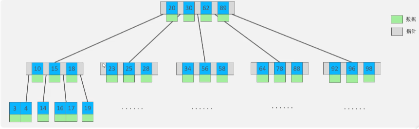
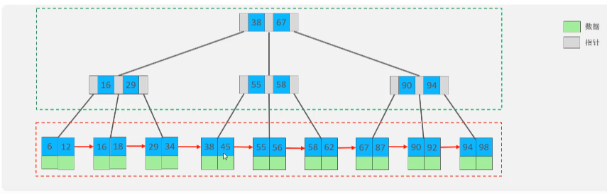
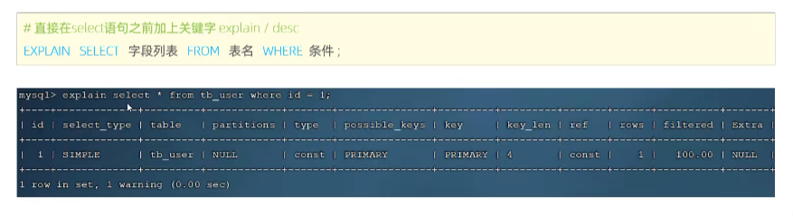

# 索引

---

索引是帮助MYSQL高效获取数据的数据结构（有序）。在数据之外，数据库系统还维护着满足特定查找算法的数据结构，这些数据结构以某种方式引用（指向）数据，这样就可以在这些数据结构上实现高级查找算法，这种数据结构就是索引。

优点：

    1. 提高数据检索效率，降低数据库的IO成本
    2. 通过索引列对数据进行排序，降低数据排序成本，降低cpu的消耗
缺点：

    1. 索引也要占用空间
    2. 索引大大提高了查询效率，同时却也降低更新表的速度，如对表进行insert、update、delete时效率降低。

---

## 索引结构

mysql 的索引实在存储引擎层实现的，不同的存储引擎有不同的结构，主要包含以下几种：

| 索引结构             | 描述                                         |
|------------------|--------------------------------------------|
| B+Tree索引         | 最常见的索引类型，大部分引擎都支持B+树索引                     |
| Hash索引           | 底层数据结构是用哈希表实现的，只有精确匹配索引列表的查询才有效，不支持范围查询    |
| R-tree（空间索引）     | 空间索引是MyIsAM引擎的一个特殊索引类型，主要用于地理空间数据类型，通常使用较少 |
| Full-text（全文索引）  | 是一种通过建立倒排索引，快速匹配文档的方式，类似于Lucene，Solr，ES    |

---

## B-Tree 索引结构

二叉树查找弊端： 顺序插入时退化成连链表，查找性能大大降低， 每个节点只能有俩子节点，层级较深，影响查找性能。

红黑树： 大量数据时节点层级较深，影响查找性能。

B-Tree（多路平衡查找树）
    
    以一颗最大度数为5的b-tree为例：

---

## B+Tree 索引结构

所有的元素都会出现在叶子节点，叶子节点形成了单项链表。

MYSQL索引数据结构对经典B+Tree进行了优化。在原B+Tree的基础上，增加一个指向相邻叶子节点的链表指针，就形成了带有顺序指针的B+Tree，提高区间访问的性能。

---

## Hash结构

哈希索引结构就是采用一定的hash算法，将键值换算成新的hash值，映射到对应的槽位上，然后存储在hash表中。

如果两个或多个键值映射到同一个槽位上，就产生了hash冲突，可以使用链表解决。

特点：

    1. hash索引只能用于对等比较，不支持范围查询
    2. 无法利用索引完成排序动作
    3. 查询效率高，通常只需要一次检索就可以了，效率通常要高于B+Tree索引.

---

为什么InnoDB使用了B+Tree 而不适用BTree或者二叉树索引？

        相对于二叉树，层级更少，搜索效率更高。
        对于BTree，无论叶子节点和非叶子节点都会保存数据，这样导致了页中存储的键值减少，指针跟着减少，要保存同样数量的数据，会增加树的高度，降低检索效率
        B+Tree每个叶子节点保存数据，检索都要到最后一层，性能稳定。并且节点间有指针，便于范围查找。

---

## 索引分类

| 分类    | 含义                          | 特点           | 关键字       |
|-------|-----------------------------|--------------|-----------|
| 主键索引  | 针对于表中主键的索引                  | 默认自动创建，只能有一个 | PRIMARY   |
| 唯一索引  | 避免同一个表中某数据列中的值重复            | 可以有多个        | UNIQUE    |
| 常规索引  | 快速丁文特定数据                    | 可以有多个        |           |
| 全文索引  | 全文索引查找的是文本中的关键词，而不是比较索引中的值  | 可以有多个        | FULLTEXT  |

InnoDB中根据索引存储形式，还可分为两类

| 分类    | 含义                             | 特点       |
|-------|--------------------------------|----------|
| 聚集索引  | 将数据存储与索引放到了一块，索引结构的叶子节点保存了行数据  | 必须有且只有一个 |
| 二级索引  | 将数据与索引分开存储，索引结构的叶子节点关联的是对应的主键  | 可以存在多个   |

聚集索引选取规则：

    1. 如果存在主键，主键索引就是聚集索引
    2. 如果不存在主键，将使用第一个唯一索引作为聚集索引
    3. 如果表没有主键且没有合适的唯一索引，则InnoDB会自动生成一个rowId作为隐藏的聚集索引

回表查询：  根据二级索引找到主键，再根据主键查询数据

--- 

## 索引语法

1. 创建索引

        CREATE [UNIQUE|FULLTEXT] INDEX 索引名 ON 表名(列名,...);

2. 查看索引
        
        SHOW INDEX FROM 表名：
3. 删除索引

        DROP INDEX 索引名 ON 表名;

---

## 性能分析

1. SQL 执行频率

    mysql 客户端连接成功后，通过show [session|global] status 命令可以提供服务器状态，通过如下指令可以查看当前数据库的INSERT、UPDATE、DELETE、SELECT 的访问频次
    
        SHOW GLOBAL STATUS LIKE 'Com_______'
2. 慢查询日志

    慢查询日志记录了所有执行时间超过指定参数(long_query_time,单位秒,默认10秒)的所有SQL语句日志。
    
    MYSQL的慢查询日志默认没有开启，需要在MySQL的配置文件(/etc/mysql/my.cnf)中配置如下信息：

        # 开启mysql 慢查询日志开关
        slow_query_log=1
        # 设置慢查询的超时时间，只要查询时间超过这个值就会被记录到慢查询日志中
        long_query_time=5

    配置完毕后需要重启mysql， 慢查询日志默认位置: /var/lib/mysql/localhost-slow.log

3. profile

    show profiles 能够在做SQL优化时帮助我们了解时间都耗费到哪里去了。通过have_profiling参数能够看到当前mysql是否支持profile操作

        SELECT @@HAVE_PROFILING
    
    默认情况下profiling是关闭的，可以通过set语句在session/global级别开启profiling：
        
        SET PRPFILING=1;

    执行一系列的sql操作，然后通过如下命令查看详情

        # 查看执行详情
        SHOW PROFILES;
        # 查看指定queryid对应sql各个阶段的耗时
        SHOW PROFILE FOR QUERY queryId;
        # 查看指定queryId对应SQL 的CPU使用情况
        SHOW PROFILE CPU FOR QUERY queryId;

4. explain 执行计划

    EXPLAIN 或者DESC命令获取SQL如何执行SELECT 语句的信息，包括在SELECT 语句执行过程中表如何连接和连接的顺序。
    
    语法：

        # 直接在select 语句之前加上关键字 explain/desc

        EXPLAIN SELECT 字段列表 FROM 表名 WHERE 条件 其他操作;

    

    执行计划中各个列的含义：
        1. id: select查询的序列号，表示查询中执行select子句或者是操作表的顺序（id相同，执行顺序从上到下。id不同，值越大越先执行）
        2. select_type: 表示select的类型，常见取值有： SIMPLE(简单表，即不使用表连接或者子查询)、PRIMARY(主查询，即外层查询)、UNION(UNION中的第二个或者后面的查询语句)、SUBQUERY(select/where之后包含子查询)等
        3. type: 表示连接的类型，性能由好到差的连接类型为：NULL > system > const > eq_ref > ref > range > index > all
        4. possible_key: 显示可能用在这张表上的索引，一个或多个
        5. key: 实际用到的索引，如果为NULL则表示没有使用索引
        6. key_len: 表示索引中使用的字节数，该值为索引字段最大可能长度，并非实际使用长度，在不损失精确性的前提下，长度越短越好.
        7. rows: MYSQL认为必须要执查询的行数，在INNODB引擎的表中，是一个估计值，可能并不总是准确的
        8. filtered: 表示返回结果的行数占读取行数的百分比，该值越大越好
        9. Extra： 一些额外的查询信息

---

22 索引使用规则-验证索引效率